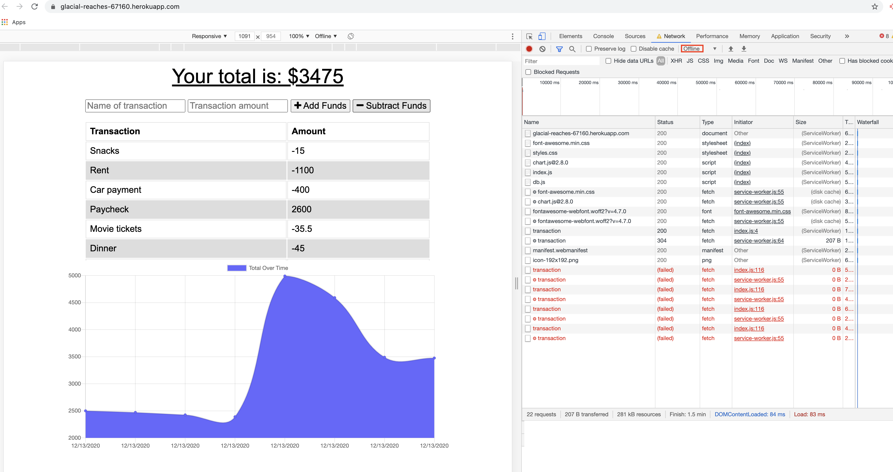

# Unit 18 PWA Homework: Online/Offline Budget Trackers

## Description

My assignment was to add functionality to an existing Budget Tracker app to allow for offline access.  After the user adds expenses to his/her budget without an internet connection, the entered transactions should populate unto the budget tracker once the user is back online.

For this app, I utilized MongoDB Atlas and deployed on Heroku.

## Table of Contents 

* [Deployment](#deployment)

* [Screenshots](#screenshots)

* [Author](#author)

## Deployment
### Heroku Link
[Click here](https://glacial-reaches-67160.herokuapp.com/)

## Screenshots

* **Offline**
Adding transactions with no internet connection

* **Back Online**
Bringing app back online showing offline-entered transactions getting added to budget tracker

## Author

* **Eric Donohue**

### Other Projects

Please visit [edonohue8](https://github.com/edonohue8/) to see more of my projects.